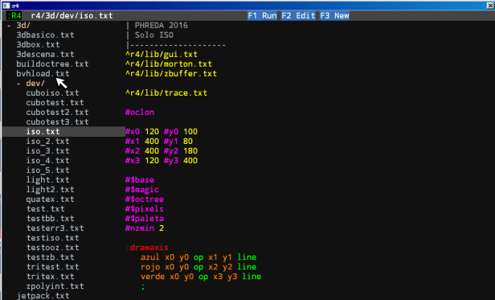
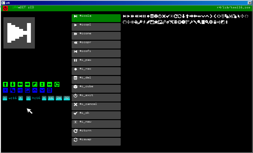
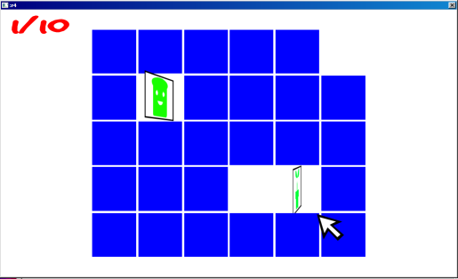
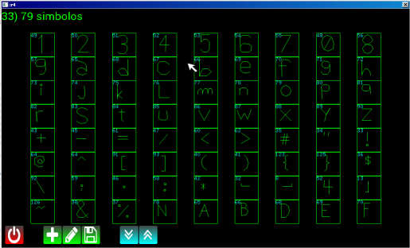
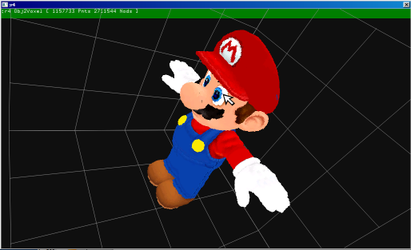
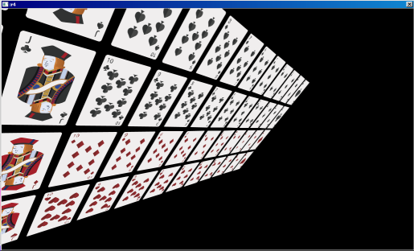

# :r4

Computer Programming Language based on ColorForth ideas

Started in 2005 along with my study of the Forth language.

:r4 is a Forth but simpler although not less powerful.

r4.exe is a fort virtual machine, with a bytecode compiler and a bytecode interpreter (very very fast).

One apps is a compiler, this generate asm for x86 in FASM syntax, see in r4asm folder.
You can code in any editor, put the .txt file in r4/ folder and this is show in main,

## some screenshots

 

The main menu, all is make in r4, this can be other source or start the any app.
hit f1 to exec, when you have bugs, some help in internal editor (made in r4 too) show this or the app crash.
hit f2 to edit

 

The debuger, with step by step play, memory dump, variable dump and stack view.
in the internal editor hit f2 and run in debugger.
There are a simple profiler with f3 key in editor and a simple compiler with f5 key.
The big optimice compiler are in developing (version 4), hit f10 in editor ans see the compiler folder

hit ctrl-E in internal editor in the include word, the extension call the apropiate editor.
.ico for icons

 

.bmr for bitmaps

 

.vsp for vector graphics

 

Some games and demos

 
 
 
 

## Quick overview

First, learn stack manipulation, every forth lang use this, use "Starting forth" or "Thinking forth".
Only stack manipulation, ColorForth and r4 avoid some forth construction.

In r4 there are two definitions things #DATA and :CODE

The behavior of the language is guided by prefixes :

* : prefix to define code
* \# prefix to define data
* ^ prefix to include definitions from other source files
* ' prefix to get the adress of code or data
* | prefix for comments (until the end of the line)
* " prefix to define strings, which end with another "
* $ hex numbers
* % binary number
* : alone is the starting point of the program

example
```
#x 2
#y 3

:cuad | a -- a^2
  dup * ;

:dist | -- d^2   distance to x y
  x cuad y cuad + ;

: dist ;
```

Flow control is different than other forths, there are built in, with blocks of code construction.
```
?? ( .. ) are IF
?? ( .. )( .. ) are IF-ELSE
( ..?? )( .. ) are WHILE
( ..?? ) are UNTIL
```

The conditionals:<br/>
0?, 1?, +?, -? are simple conditionals, they test but do not destroy the top of stack (TOS), 0? tests if the TOS=0.. and so on.<br/>
=?, <? .. and? .. are conditionals that compare two values, they destroy the TOS.

example
```
:countdown
  10 ( 1? )( 1-     | while TOS are diferent from 0
    dup "%d" print cr
    ) drop ;

```

# Actual development

This version is a bytecode interpreter for the WINE, WINCE and ANDROID platforms.

* forth-like language to program computers.
* uses prefixes to guide compiler behavior, like Colorforth but without colors..a colorless colorforth.
* has a VM, editor, games, programming samples.
* has a compiler for the FASM assembler which can make standalone .exe

- Only can generate win exec, waiting for a smart coder for lin,mac etc.

# More info

* e-mail: pabloreda@gmail.com
* download: https://drive.google.com/open?id=0Bz3UnwydnNGhQmlOSGRwaXJmX3c
* tool to compile the r4VM: https://drive.google.com/drive/folders/0Bz3UnwydnNGhRl9RSElYbkZhUU0
* videos: http://www.youtube.com/user/pablohreda
* group: http://groups.google.com/group/reda4
* twitch: https://www.twitch.tv/phreda4
